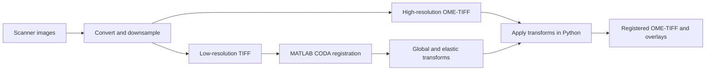

# Histology Image Pipeline

[](https://github.com/martaforjaz/histology-image-pipeline/actions/workflows/tests.yml)

A Python and MATLAB workflow for preparing multi-scanner histology images, calculating alignment at low resolution, and applying the resulting transforms to higher-resolution images.

This project organizes a research workflow into three explicit stages, with calibrated pixel spacing, command-line entry points, synthetic regression tests, and documented dependencies. It integrates **CODA**, developed by Ashley L. Kiemen and collaborators; the CODA registration algorithm is an external dependency, not an original contribution of this repository.

## Workflow



## What it does

- Converts Olympus/Evident VSI and Zeiss CZI through dedicated readers, with a shared entry point for other scanner formats.
- Generates plain TIFF or tiled, pyramidal OME-TIFF at a requested physical resolution.
- Runs CODA global and elastic registration on low-resolution images in MATLAB.
- Applies those transforms at other resolutions, using micrometres per pixel rather than relying on magnification labels.
- Exports visual registration overlays and provides tests using generated images only.
- Records per-image and per-resolution timings, with CSV reports for dataset-wide and per-scanner performance analysis.

## Repository layout

```text
01_conversion_downsampling/   Scanner readers, conversion CLI, pixel-size metadata
02_calculate_registration/   MATLAB entry point; local CODA installation goes here
03_apply_registration/       Python transform application and CLI
docs/                        User guide, converter comparison, provenance, validation
requirements/                Python dependencies by stage
tests/                       Synthetic Python tests and optional MATLAB checks
tools/                       Environment check, CODA setup and timing reports
```

## Quick start

Python 3.11 is the tested interpreter. The MATLAB calculation stage was tested on Windows with MATLAB R2024a and Image Processing Toolbox.

```bash
git clone https://github.com/martaforjaz/histology-image-pipeline.git
cd histology-image-pipeline
python -m venv .venv
```

Activate the environment with `.venv\Scripts\activate` on Windows, or `source .venv/bin/activate` on macOS/Linux. Then:

```bash
python -m pip install -r requirements/conversion.txt -r requirements/registration.txt
python tools/check_environment.py
python -m unittest discover -s tests -v
```

Alternatively, with Anaconda, create the same environment plus JupyterLab and `wsidicom` (Pramana `.dcm`) in one step, then open `01_conversion_downsampling/run_conversion.ipynb` with the **Python (histology-pipeline)** kernel:

```bash
conda env create -f environment.yml
conda activate histology-pipeline
python -m ipykernel install --user --name histology-pipeline --display-name "Python (histology-pipeline)"
jupyter lab
```

Install the external CODA dependency before calculating new registration transforms; follow the [English user guide](docs/USER_GUIDE.md). Scanner library availability varies by operating system. The original CODA scripts use Windows path conventions, so the supported MATLAB workflow is Windows.

To generate several resolutions from each source in one run, edit the settings at the top of `01_conversion_downsampling/run_conversion.py` and click **Run** in PyCharm:

```python
pth0 = r'D:\data\raw'
outpth = None  # Save the output subfolders inside pth0
file_format = 'vsi'  # 'vsi', 'czi', or 'other'
folder_names = ['2x', '10x', '20x', '40x']
pixel_resolutions = [5, 1, 0.5, 0.25]  # Micrometres/pixel
save_ome = [0, 1, 1, 1]  # 0 = TIFF, 1 = OME-TIFF, in the same order
load_native_resolution = 1
scanner_name = 'Olympus VS200'  # Replace with your actual scanner/model
scanner_manifest = None  # Optional image,scanner CSV for mixed batches
```

The reader loads each source once at the finest resolution needed, then creates every requested output from that loaded image. You may choose any number of resolutions. Set an MPP to `0` to include native resolution. Command-line usage remains available, including multiple folders and MPP values in one command; see the guide.

### Fast conversion of DICOM (Pramana) slides

`01_conversion_downsampling/run_conversion_fast.ipynb` (or `streaming_conversion.py`) writes the same files as the converter above for `.dcm` slides, pixel for pixel, but streams each slide in bands instead of loading it whole, and converts several slides at once:

```powershell
python 01_conversion_downsampling/streaming_conversion.py "D:\data\Pramana" --output "D:\data\Pramana" --folder 2x 40x --mpp 5 0.25 --save-ome 0 1 --scanner Pramana --workers 4
```

On a 24-core, 128 GB workstation, single slides converted 1.6x faster with 5-18x less peak memory (for example 220 s / 82 GB down to 137 s / 9 GB), and the low memory allows several slides in parallel. `tools/benchmark_conversion.py` repeats this comparison on your own slides and checks every output page is identical.

## Processing times

Every stage saves a separate CSV under its output/input `timings/` folder, recording per-image timings and scanner identity. Conversion separates the shared read, each output resolution's resize/save time, and the image total. MATLAB calculation and Python application also record per-image and batch totals.

Generate Excel-compatible reports for later plots:

```powershell
python tools/summarize_timings.py --input "D:\dataset" --output "D:\dataset\timing_report" --inventory "D:\dataset\scanners.csv"
```

The optional inventory identifies images without measurements. Reports provide individual totals, means and sample standard deviations by scanner, stage and resolution; skipped/failed work is excluded, repeated runs are handled explicitly, and historical images remain unmeasured until separately estimated. See the [timing and plotting guide](docs/TIMING_GUIDE.md) for scanner configuration, exact timing boundaries and report filters.

## Validation status

Local checks cover TIFF/OME metadata and export, a generated CZI file read by the actual CZI backend, simulated VSI input, affine and elastic transforms, boundary filling, dotted filenames, reference-image handling, and scale factors corresponding to the example 10x/20x/40x workflow.

An optional MATLAB integration check runs CODA on generated images and compares a Python affine warp and constant-displacement warp against MATLAB outputs. See [validation results and limits](docs/VALIDATION.md). These checks do **not** establish accuracy on every scanner or on research datasets; inspect overlays for each dataset.

## Documentation

- [Step-by-step user guide](docs/USER_GUIDE.md)
- [Timing measurements, scanner comparisons and plots](docs/TIMING_GUIDE.md)
- [Difference between the two WSI converters](docs/CONVERTER_COMPARISON.md)
- [Selection and change history](docs/SELECTION.md)
- [Testing and known limitations](docs/VALIDATION.md)
- [Using this repository on another computer](docs/GITHUB_WORKFLOW.md)
- [Third-party attribution](THIRD_PARTY_NOTICES.md)

No research images, patient information, network-share paths, MATLAB binaries, or Python virtual environments are included in the repository. Code and documentation are versioned; image data remains in a separately managed location.
